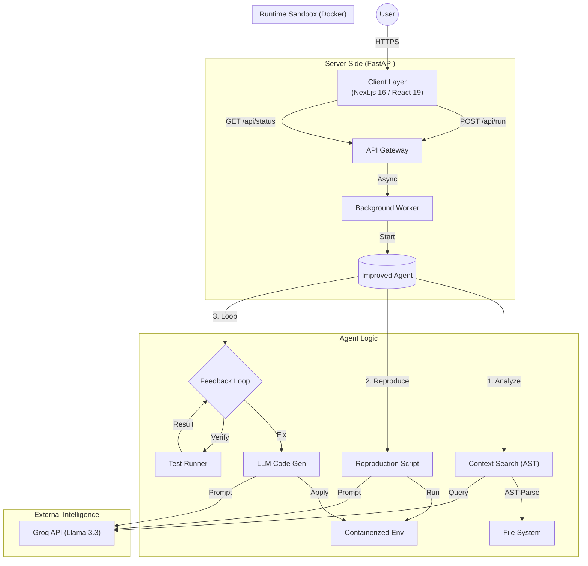

# SudoDev

    

> **SudoDev** is an autonomous AI Software Engineer capable of solving complex coding tasks, refactoring code, and debugging issues. It combines a recursive **Feedback Loop** for self-correction with a **Smart Context Search** engine to operate effectively on large codebases.

---

## System Architecture

The system uses a decoupled architecture with a React-based frontend and a Python agentic backend.

### Key Design Decisions
-   **Recursive Feedback Loop**: The agent doesn't just guess; it writes code, runs it, captures errors, and self-corrects iteratively (up to 3 attempts).
-   **Smart Context Search**: Instead of relying solely on vector databases, SudoDev uses AST (Abstract Syntax Tree) parsing combined with LLM-based relevance scoring to identify critical code sections without overhead.
-   **Sandboxed Execution**: Every agent run happens inside an isolated Docker container, ensuring safety and reproducibility.

## Key Features

-   **Dual Mode Operation**:
    -   **SWE-bench Mode**: Solves standard benchmark issues for evaluation.
    -   **GitHub Mode**: Connects to any public repository to fix reported issues.
-   **Deep Debugging**: Auto-generates reproduction scripts to confirm bugs before fixing them.
-   **Context-Aware**: Intelligently extracts only relevant classes and functions from large files to fit within LLM context windows.
-   **Live Observation**: Real-time streaming of logs, terminal outputs, and agent thoughts to the UI.

## Tech Stack

-   **Frontend**: Next.js 16 (App Router), React 19, Tailwind CSS
-   **Backend API**: Python, FastAPI
-   **AI Model**: Groq (Llama 3.3)
-   **Code Analysis**: Python AST
-   **Runtime**: Docker
-   **Styling**: Tailwind CSS 

## Contributing
Contributions are welcome! Please feel free to submit a Pull Request.

## License
Apache-2.0 License. See [LICENSE](LICENSE) for more information.1
